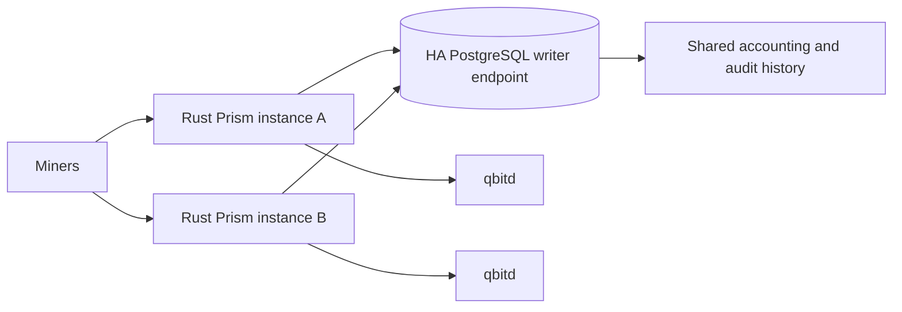

# PRISM

PRISM means **Payouts, Rewards, and Integrity Settlement Manifest**. It is the
non-custodial qbit pool in this repository: native Rust Stratum, a canonical
PostgreSQL share ledger, deterministic payouts, direct coinbase or CTV
settlement, and independently verifiable audit bundles.

The runtime is [`qbit-prism-server`](crates/qbit-prism-server/README.md).
Accounting and verification live in [`qbit-prism`](crates/qbit-prism/README.md),
and transaction construction uses `qbit-pool-builder`. qbit core continues to
own consensus, P2MR, CTV, block validation, and chain state.

## Native architecture



Each process uses a multithreaded Tokio runtime for network and database work,
with bounded CPU workers for in-process payout and audit construction. Stratum,
job refresh, block submission, CTV broadcasting, and HTTP service run in the
same native executable. There is no Python runtime or builder subprocess in the
mining path.

Multiple physical servers can serve miners simultaneously against the same
PostgreSQL database. Short transaction locks give accepted shares one global
`share_seq` order and freeze consistent payout snapshots. Each server can write;
there is no elected application writer. Database constraints deduplicate proof
replays across connections and instances. Durable, expiring claims coordinate
block candidates and CTV broadcasts.

Use one PostgreSQL **writer endpoint**, including when the database itself is
HA. A successful ordinary share ACK follows its durable commit. Keep `fsync`,
`full_page_writes`, and `synchronous_commit` enabled. Preserving acknowledged
shares after primary loss also requires synchronous replication and a failover
policy that promotes a standby containing those durable commits. An
asynchronous replica alone does not provide that guarantee.

Instances share chain identity, payout policy, signing keys, and accounting
state; a database fingerprint rejects conflicting configurations. Assign a
unique `PRISM_INSTANCE_ID` on each server, or allow a generated UUID. Local
ports, database connection limits, and CPU counts may differ. Session
extranonces come from a database sequence to avoid overlap across instances.

See [ledger operations](docs/prism-ledger-ops.md) for the transaction and recovery
contract, and [Rust migration](docs/prism-rust-migration.md) before upgrading an
existing deployment. Python and Rust coordinators must not run together.

## Reward accounting

PRISM follows the ordered-share reward model described by
[OCEAN's TIDES documentation](https://ocean.xyz/docs/tides), adapted to qbit
settlement. An accepted proof keeps its individual identity and work weight.
The reward window includes the newest eligible shares until it reaches
`8 × network_difficulty`; only the needed fraction of the oldest share counts.
A shorter historical log contributes all eligible work.

A found block uses the snapshot committed into its issued job. Both job issue
time and acceptance time must be no later than the snapshot anchor, so shares
arriving later cannot change an already published split. The canonical ledger
clock and transaction boundary make this rule consistent across servers.

When the pool has no historical shares, bootstrap work pays its solver, subject
to the configured payout and fee policy. There is no minimum miner-count gate.
Once historical shares exist, jobs use the shared reward window. A hash meeting
the network target but falling below its assigned share target is preserved as
a durable candidate; it earns network-difficulty credit only after confirmation
that its block is on the active chain.

Normal shares receive the difficulty assigned to their job. Vardiff adjusts each
connection within configured bounds. The optional high-difficulty listener
serves the same ledger and payout universe. Accepted stale-grace shares carry
an explicit audit credit policy. Mainnet permits the same bounded one-parent
grace as other chains (`PRISM_STRATUM_STALE_GRACE_SECONDS`, default 3 seconds).
Retained accepted-work evidence restores vardiff hints across reconnects and hosts.

## Payouts and settlement

Operator-facing amounts are integer **bits**, the smallest qbit unit. Legacy
`*_sats` names in accounting types, audit JSON, and verifier flags mean the same
unit and remain compatible.

PRISM combines each miner's gross reward with prior carry-forward balances,
including balances for miners with no current shares. Its default economic
output floor is:

```text
3,680 input bytes × 1 bit/byte × 4 safety multiplier = 14,720 bits
```

Set `PRISM_PAYOUT_MIN_OUTPUT_BITS` for an explicit floor or configure the
`PRISM_PAYOUT_*` formula inputs. Positive amounts that cannot be paid remain
visible as carry-forward balances. Construction fails if the selected
recipients cannot fund a valid exact-value coinbase; it does not silently drop
entitlements or create an overpayment.

Direct settlement pays miners in P2MR coinbase outputs. With
`PRISM_CTV_SETTLEMENT_ENABLED=1`, overflow or smaller eligible payments can use
CTV outputs committing to later fanout transactions. The operator cannot
redirect those committed payments. Conservative defaults are:

| Setting | Default |
| --- | ---: |
| Direct coinbase payout floor | 10,485,760 bits |
| Total settlement coinbase output cap | 16 |
| Direct recipient output cap | 12 |
| Recipients per CTV fanout | 1,000 |
| CTV fee premium | 12,000 basis points, or 120% of the market rate |

These are pool/miner compatibility policies. The hard settlement ceiling is
500 outputs. Configure them with `PRISM_DIRECT_COINBASE_PAYOUT_FLOOR_BITS`,
`PRISM_MAX_COINBASE_SETTLEMENT_OUTPUTS`, `PRISM_MAX_DIRECT_COINBASE_OUTPUTS`,
`PRISM_MAX_CTV_FANOUT_RECIPIENTS_PER_TRANSACTION`, and
`PRISM_CTV_FANOUT_FEE_PREMIUM_BPS`.

An optional explicit pool fee is governed by `PRISM_POOL_FEE_*`. Output order is
`canonical` by default; `PRISM_COINBASE_OUTPUT_POLICY=pool-fee-first` requires a
configured pool fee. Fee policy and output order are part of the shared cluster
fingerprint and signed audit evidence.

Coinbase maturity is 1,000 blocks. Immature disconnected blocks stop
contributing to current balances and can reactivate. Terminal reversal retains
the historical records. A mature disconnect stops normal accounting for
operator investigation. The carry-forward integrity endpoint replays active
rows and exposes a deterministic `audit_head_sha256` that operators can mirror.

CTV broadcasting can run on several instances: database claims coordinate
work, and the parent must be mature and active. Fee-bearing committed fanouts
can be broadcast without a wallet. Optional positive CPFP sponsorship needs a
configured wallet. Sponsorship funding remains reserved until the signed child
confirms. Persistent wallet locks and the wallet's recorded child transaction
protect funding across mempool eviction and restart, so the package can reuse
its exact saved bytes.
An unsigned reservation whose funding disappears is retired and replaced;
retired outpoints remain recorded for targeted wallet-lock cleanup and cannot
be assigned to another payout. Saved signed packages remain immutable.
If qbit cannot unlock a spent coin after repairing an abandoned child, cleanup
remains pending for that outpoint; unrelated wallet locks stay intact.
On mainnet, configure a reviewed positive
`PRISM_CTV_FANOUT_FEE_MARKET_RATE_BITS_PER_1000_WEIGHT`; a new chain cannot
provide a useful market estimate from absent transaction history.

## Audit bundles and HTTP compatibility

A logical audit bundle includes the eligible shares, found-block anchor, prior
balances, payout policies, signed ledger attestation, reward and coinbase
manifests, and any CTV fanout manifests. Ordinary bundles use
`qbit.prism.audit-bundle.v1`; explicit credit-policy rows use v1.1.

New database records retain the non-share body plus an immutable reference to a
canonical ledger range. Reconstruction verifies the share digest and canonical
bundle hash before serving the full logical bundle. Overlapping block windows
therefore reuse share rows instead of copying the same arrays into every audit.
Existing inline bundles and imported filesystem artifacts retain their canonical
hashes. See [storage sizing](docs/prism-storage-sizing.md).

Verify against an independently trusted ledger public key and on-chain coinbase:

```sh
cargo run --locked -p qbit-prism --bin qbit-prism-audit-verify -- audit-bundle.json \
  --coinbase-tx-hex "$COINBASE_TX_HEX" \
  --ledger-writer-public-key-hex "$LEDGER_WRITER_PUBLIC_KEY_HEX" \
  --expected-coinbase-value-sats "$EXPECTED_COINBASE_VALUE_SATS"
```

Do not obtain the trusted key solely from the artifact being verified.

The public dashboard contract remains under `/public/v1`, including pool
summary, hashrate series, reward/3h leaderboards, blocks, settlement artifacts,
fanouts, mining configuration, and miner earnings, payouts, and workers.
Amounts, decimal string conventions, error envelopes, CORS, ETags, and aliases
are retained. See the [API guide](docs/public-dashboard-api/README.md) and
[OpenAPI schema](docs/public-dashboard-api-v1.openapi.yaml).

Operational routes include `/healthz`, `/metrics`, `/audit/latest`,
`/owed-balances`, `/audit/share-window`, `/audit/carry-forward-integrity`, block
payout/bundle/CTV routes, and fanout status routes. They share the audit listener;
expose only `/public/v1` through a public reverse proxy. Health and Prometheus
counters describe the individual process; dashboard accounting reads the shared
database. The old Python scheduler's detailed metric series are replaced by
native process health and counters.

Both runtime roles serve `/metrics` with HTTP 200 and freshness headers, even
before the first observation or when it is stale. Read `X-Prism-Metrics-State`
alongside readiness from `/healthz`; see the [metrics freshness contract and
inspection command](docs/prism-ledger-ops.md#health-diagnostics-and-validation)
and the [generated metric inventory for both roles](docs/prism-native-metrics.md).
Use the [deployed-alert migration and rules-file diff](docs/prism-alert-migration.md)
when cutting over from Python; it maps every retired alert to its native rule or
explains why there is no replacement.

## Run and operate

Build native binaries:

```sh
cargo build --locked --release -p qbit-prism-server -p qbit-prism --bins
```

Configure `.env` from [.env.example](.env.example). Retain existing signing keys
when migrating. For a new pool, generate separate manifest and ledger seeds and
derive the ledger public key using the builder's `--print-public-key-hex` option
as shown in the repository [quick start](README.md#run-prism-pool).

The local Compose profile starts qbitd, the PostgreSQL primary and public read
replica, the Rust coordinator, and the native public API service:

```sh
make up-prism-pool
make prism-self-check
```

Default Stratum is port 3340; the audit listener is port 3341. Compose keeps HTTP
inside the coordinator namespace. Usernames are
`<qbit-payout-address>[.<worker>]`.

For an external database shared by multiple hosts:

```sh
docker compose -f compose.yaml -f compose.prism-external-db.yaml \
  --profile prism up -d qbitd prism-coordinator
```

Set the same `PRISM_DATABASE_URL` on all hosts. `QBIT_RPC_HOST` is overridable;
each instance may use its own fully synchronized qbitd. See the migration guide
for production image/storage overlays and external-node startup.

Common commands, with the operator environment exported:

```sh
qbit-prism-server check-config
qbit-prism-server migrate
qbit-prism-server run
qbit-prism-server healthcheck --url http://127.0.0.1:3341/healthz
qbit-prism-server self-check
qbit-prism-server import-audits --root /var/lib/qbit-prism/audit
qbit-prism-server backfill-ctv
qbit-prism-server broadcast-ctv
```

`check-config` validates configuration without listeners. `self-check` checks a
live deployment, including node identity, database integrity/durability, and
HTTP readiness. Migration/import commands and native defaults are documented
in the [server README](crates/qbit-prism-server/README.md).

Tune `PRISM_RUNTIME_WORKERS`, `PRISM_JOB_BUILD_EXECUTOR_WORKERS`, and
`PRISM_DATABASE_MAX_CONNECTIONS` against measured load. Size database connections
across all instances. The former Python batch-writer, writer-lease, subprocess,
and incremental-refresh scheduler settings no longer configure the runtime.

## Validation and further reading

```sh
cargo test --locked -p qbit-prism
bash test/prism-native-tests.sh
QBITD_BIN=/path/to/qbitd bash test/prism-native-tests.sh live
cargo run --locked --release -p qbit-prism-server -- benchmark \
  --shares 100000 --miners 100 --iterations 10 --output-json /tmp/prism-builder.json
```

The native test wrapper uses a supplied `PRISM_TEST_DATABASE_URL` or starts an
isolated local PostgreSQL cluster. Its default database mode runs all server
targets and then explicitly runs the ignored database collector test, matching
the CI invocation. Live tests use real qbitd regtest and bounded
CPU mining. The builder benchmark measures synthetic build-and-verify work;
complete Stratum-to-durable-commit capacity requires separate load evidence.

- [Migration and multi-instance deployment](docs/prism-rust-migration.md)
- [Ledger operations and recovery](docs/prism-ledger-ops.md)
- [Native metrics inventory](docs/prism-native-metrics.md)
- [Mainnet deployment](docs/mainnet-deployment.md)
- [Storage and resource planning](docs/prism-storage-sizing.md)
- [Native performance measurement](docs/prism-payout-artifact-measurement.md)
- [Optional capacity qualification](docs/prism-capacity-readiness.md)
