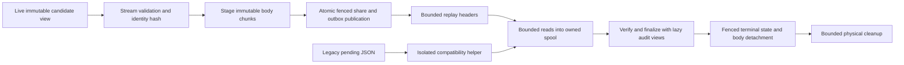

# Bounded candidate persistence and replay

This guide covers the 2.x.x work for [#255](https://github.com/Qbit-Org/qbit-mining-bootstrap/issues/255)
and its release dependency on [#254](https://github.com/Qbit-Org/qbit-mining-bootstrap/issues/254).
It includes the complete cursor enumeration introduced by PR #256 and the
offline accepted-pending recovery command introduced by PR #259.

## Storage and resource settings

Apply `001_share_ledger.sql` followed by `002_candidate_bodies.sql` before
starting this release, whichever storage version it writes.
`PRISM_POSTGRES_INIT_SCHEMA=1` performs this at startup; the migrations are
idempotent. Replay headers and terminal outbox statements use the migrated
columns for both storage versions, so the coordinator and the offline recovery
command refuse a database without `002`; `PRISM_CANDIDATE_STORAGE_VERSION=1`
stops version 2 writes but does not make an unmigrated database usable.
Existing version 1 JSONB outbox rows remain intact
and readable. New version 2 rows reference a sealed body and carry a small replay
header; the old `candidate` column is null for those rows.

| Setting or boundary | Default / limit |
| --- | --- |
| `PRISM_CANDIDATE_STORAGE_VERSION` | `2`; set `1` for compatible-reader rollout or rollback |
| `PRISM_CANDIDATE_SPOOL_DIR` | Empty selects the system temporary directory; choose a persistent-capacity mount for large workloads |
| `PRISM_CANDIDATE_SPOOL_RESERVATION_BYTES` | 4 GiB of admitted candidate body and index files per ledger instance |
| `PRISM_BLOCK_REPLAY_PAGE_SIZE` | 1,024 descriptors; supported range 1–1,024 |
| Replay header page | 256 KiB and the configured row cap |
| Stored chunk / read page | 256 KiB per chunk; at most three chunks per read |
| Index transfer | 256 page entries or 64 field spans per statement |
| Shared helper admission | One legacy, record-normalization or finalization helper at a time per process; deadline/cancellation also apply while awaiting admission |
| Legacy conversion / JSONB comparison helper | 4 GiB address-space limit, 600-second deadline, 64 KiB retained diagnostics |
| Oversized audit record helper | 4 GiB address-space limit, 300-second deadline, 1 MiB metadata response ceiling |
| Finalization SQL transport | 4 GiB statement spool, one helper under the writer gate, 4 GiB helper address space, 600 seconds or the shorter operation deadline |

Replay retains at most 1,024 queued descriptors. When admission fills, enumeration
pauses before registering further credit floors or payout previews. The existing
enumeration-owed gate keeps job builds blocked until the queue drains and the
remaining durable rows are handled, including when the last SQL page was exhausted.

Hydration limits ordinary native JSON decodes and the aggregate metadata skeleton
to 1 MiB. Larger arrays, objects and strings remain spool-backed views with disk
indexes. String decoding carries incomplete escapes and surrogate pairs across
slices; block submission streams its encoded body with an exact content length.
Consensus-bounded metadata needed by existing consumers is decoded in slices and
joined explicitly. This is a bound on coordinator work units, not a claim that
arbitrary metadata or PostgreSQL/helper memory is independent of input size.

The codec preserves the historical identity bytes, including neutralizing only
the pending share's acknowledgment timestamp. Append retries compare the digest
and the actual body, using isolated JSONB comparison when different encodings
may be equivalent. Standalone intent persistence retains its historical
digest-only retry rule. Staging and sealing grant no share credit; publication
and credit remain one synchronous, fenced commit.

Candidate spool reservations include the disk index and are released explicitly
on close and failed hydration. Disk exhaustion and helper capacity/deadline
failures leave valid durable candidates pending for retry. They must not be
classified as corrupt bodies. Monitor the spool filesystem and container memory
separately: reservations do not bound filesystem page cache.

Finalization retains the existing atomic SQL. Its text streams to a temporary
file; an isolated `psql` process owns the complete statement buffer. PostgreSQL
still parses that complete statement, so server memory and temporary-file
capacity remain size-dependent. This transport preserves the native ledger's
exact DSN, private schema options, writer-session guards and operation deadlines.
The fixed helper limits are implementation constants, not environment settings.

## Problem and evidence

A streamed candidate identity hash did not bound the surrounding pipeline.
[Candidate construction](https://github.com/Qbit-Org/qbit-mining-bootstrap/blob/d39280070517a1bd66e09d5cfe8cd330a2be1f2f/lab/prism/block_candidates.py#L1145)
materialized the share sequence and validated the entire intent with `json.dumps`;
[append](https://github.com/Qbit-Org/qbit-mining-bootstrap/blob/d39280070517a1bd66e09d5cfe8cd330a2be1f2f/lab/prism/share_ledger.py#L4223)
subsequently encoded the nested intent through `_jsonb_literal`;
[startup replay](https://github.com/Qbit-Org/qbit-mining-bootstrap/blob/d39280070517a1bd66e09d5cfe8cd330a2be1f2f/lab/prism/share_ledger.py#L4580)
decoded full intents inside a single `json_agg`.
Limiting candidate count, or returning one row per candidate, still permits one
large native JSON decoder call. The downstream reproducibility check also read
an aggregate audit window and built a Python ID set, and canonical audit
finalization reparsed complete bundles.

The original portable experiment used CPython 3.14.7, 375,000 synthetic shares
and approximately 232 MB per candidate. It reproduced long observer pauses with
cyclic GC disabled. This establishes the codec mechanism; it is neither a valid
mined-block fixture nor proof of the instruction responsible for a production
exit. Production runs x86_64. Recorded one-candidate replay and retirement remain
plausible contributors to the observed exits, which had little recorded GC time.

The membership experiment below separately measures the downstream omission
check against PostgreSQL 16.15, psycopg 3.2.13 and CPython 3.14.7 in ARM64 Docker.
The fixture contains 375,000 actual ledger rows and runs a real writer-session
proof actor alongside the operation. Runs were serial; each result is one run,
not a distribution or a production capacity estimate.
The first runs used default allocator settings. Repeats with the coordinator's
`MALLOC_ARENA_MAX=2` policy are listed separately.

| Phase | GC | Wall time | Largest observer delay | Process high-water RSS |
| --- | --- | ---: | ---: | ---: |
| Bounded membership | disabled | 0.449 s | 5.8 ms | 48 MiB |
| Prior aggregate read | disabled | 1.432 s | 309.9 ms | 903 MiB |
| Bounded membership | enabled | 0.465 s | 7.5 ms | 48 MiB |
| Prior aggregate read | enabled | 1.554 s | 352.5 ms | 903 MiB |
| Bounded membership, 1,024 rows | disabled | 0.009 s | 1.6 ms | 48 MiB |
| Bounded membership, two arenas | disabled | 0.453 s | 7.3 ms | 48 MiB |
| Prior aggregate, two arenas | disabled | 1.487 s | 318.7 ms | 903 MiB |
| Bounded membership, two arenas | enabled | 0.482 s | 13.5 ms | 48 MiB |
| Prior aggregate, two arenas | enabled | 1.483 s | 350.3 ms | 903 MiB |

After adding native COPY backpressure, fresh two-arena runs measured 0.453 s
(GC disabled) and 0.508 s (enabled), with maximum observer delays of 15.0 ms and
70.9 ms respectively and the same 48 MiB high-water RSS. Their aggregate
controls measured 320.7 ms and 323.9 ms observer delays and 903 MiB high-water
RSS. Maximum bounded-phase heartbeat wake lateness was 31.4/54.1 ms, with
102.9/76.2 ms proof calls. These single-run variations are recorded rather than
attributed to a production cause; they are not a worst-case latency guarantee.

There were no proof errors. Maximum proof duration was 8.4 ms for the large
GC-disabled bounded phase versus 320.8 ms for the aggregate phase. GC-enabled
proof maxima were 23.8 ms and 357.7 ms. The enabled aggregate run also recorded
a 28.7 ms generation-0 collection. Destruction of its returned row graph took
25.8 ms separately. These measurements must not be added together to infer a
production pause, and RSS includes the interpreter and native client.
The improved harness also separates heartbeat wake lateness from proof-call
duration: in the two-arena GC-enabled run, the aggregate phase delayed a wake
by 298.4 ms even though its slowest proof call took only 6.0 ms. Bounded
membership had 9.9 ms wake lateness and a 42.6 ms proof-call maximum. A short
database round trip therefore does not by itself establish timely scheduling.

A separate audit experiment writes a 231,202,664-byte JSON artifact containing
375,000 synthetic shares and scans, walks, streams, and retires its actual
`CanonicalAuditBundleView`. Three artifacts run sequentially; the baseline
performs one decode of their combined array, matching the aggregate boundary.
It uses CPython 3.14.7 ARM64 Docker and `MALLOC_ARENA_MAX=2`.

| Audit phase (three candidates) | GC | Largest observer delay | High-water RSS |
| --- | --- | ---: | ---: |
| Streamed scan/walk/encode/retirement | disabled | 8.5 ms | 32 MiB |
| Whole aggregate decode | disabled | 1,449 ms | 2.15 GiB |
| Whole-graph reference-count retirement | disabled | 142 ms | — |
| Streamed scan/walk/encode/retirement | enabled | 21.3 ms | 32 MiB |
| Whole aggregate decode | enabled | 1,473 ms | 2.15 GiB |
| Whole-graph reference-count retirement | enabled | 139 ms | — |

The GC-enabled aggregate recorded one 117 ms collection. Explicit view retirement
took less than 0.14 ms in each run and released both weakly observed owners before
cyclic GC. A separate traced single-candidate run peaked at 1.35 MB for scan,
1.33 MB for lazy iteration and 2.14 MB for encoding; traced wall times are excluded
from the timing comparison. A 1,024-share control also passes. This probe has an
observer thread, not a native lease actor; use the membership and full pipeline
qualification for heartbeat behavior.

Independent PostgreSQL backpressure qualification also froze a disposable server
for six seconds during COPY. The default Linux `LibpqWriter` accepted 60 MiB while
frozen and grew client RSS by 49 MiB. Per-chunk flushing kept RSS flat and blocked
until the server resumed; both preserved all 3,532,045 rows. A trigger-throttled
consumer confirmed statement-timeout rollback, connection reuse and producer
cancellation. Unfrozen throughput was comparable (4.66–4.88 s default versus
4.81–4.87 s flushing). This measures native transport allocation separately from
Python JSON allocation. The committed slow-consumer regression fails with the
prior writer and passes with explicit flushing.

## Native candidate pipeline qualification

`tests/perf/candidate_storage.py` creates a private disposable PostgreSQL schema
and exercises the production prepare, append, exact retry, header enumeration,
hydration, lazy walk, close, terminalization and janitor paths. A real
writer-session proof actor runs beside each phase. The fixture supplies 375,000
synthetic shares and 232,787,365 canonical bytes per candidate, under CPython
3.14.7, PostgreSQL 16, psycopg 3.2.13 and ARM64 Docker with `MALLOC_ARENA_MAX=2`.
These measurements follow the final spool-view integration and are separate
from the real mined-block gate.

| Candidates | GC | Largest observer delay | High-water RSS | Largest proof call | Largest heartbeat wake lateness |
| --- | --- | ---: | ---: | ---: | ---: |
| 3 | disabled | 28.0 ms | 103 MiB | 5.3 ms | 23.8 ms |
| 3 | enabled | 5.9 ms | 101 MiB | 3.9 ms | 7.6 ms |
| 1 | disabled | 4.6 ms | 101 MiB | 3.9 ms | 6.7 ms |
| 3 × 20 generations, 1,024 shares | disabled | 11.1 ms | 59 MiB | 7.4 ms | 7.9 ms |

All four runs passed without proof errors. Each explicit close returned spool
reservations to zero and released the weakly observed body owner. The larger
delay in the GC-disabled run is retained as observed; these serial single runs
are not a worst-case guarantee or production-equivalent timings.

```sh
python tests/perf/candidate_storage.py \
  --database-url "$TEST_DATABASE_URL" --shares 375000 --candidates 3 --gc off
```

Repeat with `--gc on`, with `--candidates 1`, and with
`--shares 1024 --candidates 3 --generations 20 --gc off` for repeated ownership
retirement without cyclic GC. This harness creates and drops its own private
schema; supply a disposable database and run timing measurements serially.

## Reproducibility check

A replayed candidate is reproducible only when its recorded share IDs cover
every ID in the durable window at its declared anchor and difficulty. Order,
duplicate IDs, and extra recorded IDs do not change this historical subset
rule. Missing durable IDs still reject replay. The check does not substitute a
new ledger window for the recorded candidate window or grant share credit.

`candidate_window.py` streams IDs through PostgreSQL COPY into a private
transactional temporary table, then returns one boolean from an exact text
anti-join. COPY writes are at most 16 KiB and flush the native output buffer before the
producer advances, with cancellation/deadline checks at
most 256 records apart. Oversized individual strings are escaped and encoded in
4,096-character pieces. PostgreSQL join memory can spill under an 8 MiB
`work_mem`; the operation uses a read slot and never takes the writer-lease
lock. Failure rolls back the temporary table, and the candidate's existing retry
starts from its replayable immutable source. The psql fallback spools its input
and caps captured diagnostic text at 64 KiB. In-memory ledger compatibility uses
an on-disk SQLite ID index with a 2 MiB page cache. Its digest index narrows
lookups, then compares the actual ID bytes from file spans; a digest collision
cannot satisfy membership.

## Running qualification

Use disposable databases only. The membership harness deliberately replaces
share rows in the supplied database. Initialize the ledger schema first, then
run in the same Python image as the coordinator:

```sh
python tests/perf/candidate_window_membership.py \
  --database-url "$TEST_DATABASE_URL" --shares 375000 --gc off \
  --prepare-disposable-fixture
```

For the standalone audit experiment:

```sh
python tests/perf/canonical_audit_retirement.py \
  --shares 375000 --candidates 3 --gc off --baseline
```

Repeat with `--gc on` and with `--shares 1024`. Use `--trace` in a separate
single-candidate run to measure allocations without conflating tracing overhead
with ordinary timing. Run large measurements serially.
Record image/source IDs, architecture, Python and native-client versions, raw
output, bytes per phase, observer delays, proof latency/errors, GC events,
allocation/ownership counts and retained RSS after drain. Separate lazy decode,
reference-count retirement and forced-GC controls; force GC only in the isolated
qualification process.

The live Stratum gate also has a primed, wallet-free fixture that first submits
three ordinary valid shares, then solves a real block. It uses the pinned qbit
functional helpers and binary. Historical node mocktime keeps ASERT difficulty
above the ordinary-share target. Only this disposable fixture permits the old
template timestamp; coordinator/database clocks and all lease budgets stay
unchanged.

```sh
QBIT_PRISM_LIVE_POSTGRES=1 \
QBIT_PRISM_LIVE_NATIVE_POSTGRES=1 \
QBIT_PRISM_LIVE_PRIMED_WINDOW=1 \
QBIT_PRISM_LIVE_AUDIT_API=1 \
bash test/test-prism-stratum-regtest-live.sh
```

Run the gate in Docker with access to its Docker daemon, the pinned qbit
binaries and functional helper tree, Rust tools, PostgreSQL client, and psycopg.
Use a unique `QBIT_PRISM_POSTGRES_CONTAINER` when several workspaces run gates.
For abrupt restart qualification, also set `QBIT_PRISM_LIVE_RESTART_REPLAY=1`.
That test entry point verifies the share/outbox commit through an independent
connection, exits before the first node offer, stops every miner, and starts the
normal coordinator. The successor must recover and finalize the exact persisted
hash/digest/share once. No production fault-injection switch is added.

## Design choices




Small candidate-count pages are useful admission controls, but a byte bound must
also cover each native decoder call. Returning one complete JSON row per
candidate leaves the single-candidate failure mode intact. Moving work to a
Python thread does not isolate a C codec that holds the interpreter lock, and
disabling cyclic GC does not bound reference-count destruction.

The implementation separates durable candidate identity from its transport and
retained representation. Immutable body chunks and small replay metadata permit
bounded reads and retries without retaining nested share dictionaries. An
additive format also preserves the old pending rows for compatible recovery.
Staging a body must not credit its share: the existing atomic, fenced share/outbox
publication remains the visibility boundary. Cleanup first detaches terminal
work, then reclaims unreachable body data in bounded operations.

An alternative normalized child table with one SQL row per share would simplify
some range queries, but duplicates the canonical intent model, makes exact legacy
serialization harder to preserve, and still needs a policy for oversized records
and non-share collections. Chunked canonical bytes retain the identity contract
and separate transport sizing from mining rules, at the cost of chunk/index
integrity checks, spool capacity and a compatible-reader rollback floor.

Pure-Python JSON is useful in the standalone recovery tool, but its cooperative
scheduling does not bound its object graph or retirement cost. Isolated helpers
are appropriate for legacy or oversized materialization that cannot be streamed
through the supported codec. They require explicit deadlines, capacity limits,
shutdown ownership and recoverable resource-pressure behavior. The ordinary path
must not fall back to whole-window decoding in the coordinator when such a
helper or its spool is unavailable.

Dual-writing the entire old JSON body would ease binary rollback but retain the
original encoding and allocation boundary. A larger lease threshold or suppressed
alert would leave that boundary unchanged and is not part of the fix.

## Validation contract

| Area | Required assertion |
| --- | --- |
| Identity | Old and new canonical hashes are byte-identical across ordinary, Unicode, escaped, empty and large windows; pending timestamps normalize identically. |
| Exact retry | Equivalent JSONB numeric/key-order representations retain historical retry behavior; different content is refused even under an injected digest collision. |
| Malformed input | Invalid field types, forbidden JSONB text, malformed encodings, missing chunks, bad offsets and digest/count mismatches fail closed without publishing partial work. Resource pressure remains distinguishable from corrupt data. |
| Atomicity | Upload/seal alone credits no share. Share credit and the outbox reference appear in the same fenced commit. A lost acknowledgment replays exactly once. |
| Fencing | A stale writer/session cannot publish, mutate sealed content or terminalize another session's work. Recheck after hydration/comparison, including takeover races. |
| Replay | Cursor enumeration remains complete across equal timestamps, byte-truncated pages, more candidates than one page, one huge candidate and several huge candidates. Oversized work cannot silently disappear. |
| Cancellation and retries | Interrupt encoding, upload, hydration, helper work, finalization and cleanup; preserve durable pending work, release private resources and allow a fresh retry. |
| Shutdown and ownership | Join workers/helpers, close owned file/index handles and release retired representations before cyclic GC, including exceptions and repeated generations. Do not close a source still owned by legitimate work. |
| Stale cleanup | Preserve active-chain accepted candidates and accepted-parent accounting rules. Detach terminal references under the fence, then reclaim unreachable data without a long writer-lease lock. |
| Mining and payouts | Real Stratum shares and a mined block pass normal verification/accounting, including abrupt process exit before the first node offer; Python/Rust parity and the ordinary lease gates remain green. |

Performance qualification records peak bytes per codec/transport call, file-index
buffering, native output buffering, admitted spool bytes, helper count and memory,
retained representations after drain, observer scheduling and real lease-proof
behavior separately. Exercise at least 375,000 shares per candidate and both one-
and three-candidate replay, GC enabled/disabled and small-window controls. Stress
many recipients, small audit segments and an oversized individual record as well
as ordinary large windows. A fixed number of candidates or records is not a byte
bound. Allocation tracing belongs in separate runs from ordinary timing.

## Coordination and production acceptance

#254 owns daemon sequence retention, matched self-check adoption, fallback
window construction, exception ownership, and their process metrics. Candidate
changes must consume its replayable byte-backed sequence interface and preserve
its payout-generation, balance-check and accepted-parent fences. Review the
combined ownership graph after both branches land; passing the candidate tests
alone does not qualify #254's independent paths.

Before enabling new storage in production, rehearse schema upgrade, legacy
pending replay, partial staging cleanup, exact retries, stale-session refusal,
shutdown, and rollback against a representative backup on x86_64. Capacity-plan
spool space and helper memory from measured candidate sizes and solve/retirement
rates. A spool reservation is a disk admission bound, not a bound on filesystem
page cache; include helper RSS, container file memory and file-descriptor counts
in the capacity review. Resource pressure must leave valid pending work recoverable.

Use an additive rollout: deploy and qualify the compatible reader before
enabling chunked writes. Record pending counts, candidate identity hashes,
credited-share state and body integrity before and after the migration rehearsal.
An interrupted upload must expose neither partial candidate work nor credited
shares without their outbox entry. Lost acknowledgments must be safe to retry
under the original exact comparison and writer-session fences.

Once a chunked outbox body exists, the rollback floor is the compatible reader
with new-format writes disabled. Repinning directly to the investigated
production revision is unsafe: it cannot replay the new representation. A
further rollback requires either draining the pending work or a separately
verified conversion with the writer stopped, followed by identity and durability
checks. Keep the additive body tables during rollback; dual-writing the full
legacy JSON would restore the encoding boundary this change removes.

Production acceptance requires the #254 minimum **two-hour continuous
observation** in one process epoch after any approved restart. Include at least
two naturally scheduled self-checks, daemon fallback and recovery, live solves,
real pending-candidate replay, accepted-parent accounting, both public Stratum
lanes and a scheduled backup. Extend the observation when a required workload
has not occurred.

Require no unexplained restart, no new 0.8/1.0 late-wake or exit-guarantee-breach
increments, no hidden durable hard exit, no hash/payout divergence, no lost or
duplicated credit, complete replay, and stable ownership/spool/backlog levels
after drain. Record 0.5 diagnostics, GC distributions and Python/native/Rust
memory separately. Alert silence is not evidence that raw counters remained
unchanged. Any recurrence or stale-session write fails acceptance.

Deployment and production restarts require the normal operator-approved pin
workflow. This implementation and its Docker experiments do not deploy anything,
change production configuration, or establish a proven production root cause.
